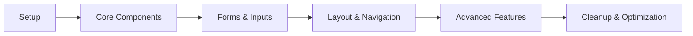

# Mantine UI Migration Guide für VigorLog

## Übersicht

Dieser Guide beschreibt die schrittweise Migration von shadcn/ui zu Mantine UI als einheitliches Framework für VigorLog. Mantine UI wurde ausgewählt aufgrund seiner umfangreichen Komponenten-Bibliothek, exzellenten TypeScript-Unterstützung und Mobile-First Ansatz.

## 1. Warum Mantine UI?

### Vergleich mit aktueller Lösung

| Feature | shadcn/ui (aktuell) | Mantine UI |
|---------|-------------------|------------|
| Bundle Size | ~10KB | ~95KB |
| Komponenten | 30+ | 100+ |
| Mobile Ready | ⭐⭐⭐ | ⭐⭐⭐⭐⭐ |
| Form Management | Extern (react-hook-form) | Eingebaut |
| Charts | Extern (recharts) | @mantine/charts |
| Notifications | Extern | Eingebaut |
| Dark Mode | Manuell | Eingebaut |
| TypeScript | ⭐⭐⭐⭐ | ⭐⭐⭐⭐⭐ |
| Capacitor Compatible | ✅ | ✅ |

### Killer Features für VigorLog

1. **Eingebaute Health Components**
   - Progress rings für Health Scores
   - Stats cards mit Trends
   - Timeline für Check-in History

2. **Mobile-optimierte Inputs**
   - Touch-freundliche Slider
   - Native-feeling Date/Time Picker
   - Swipe-Gesten Support

3. **Fortgeschrittene Features**
   - Spotlight Search (Cmd+K)
   - Notifications System
   - Form Validation
   - Modals & Drawers

## 2. Migration Strategie

### Phasen-Plan



## 3. Setup & Installation

### Schritt 1: Dependencies installieren

```bash
# Core Mantine packages
npm install @mantine/core @mantine/hooks @mantine/form
npm install @mantine/dates @mantine/charts @mantine/notifications
npm install @mantine/spotlight @mantine/modals @mantine/dropzone

# PostCSS for Mantine
npm install postcss postcss-preset-mantine postcss-simple-vars

# Date library
npm install dayjs

# Remove old dependencies (nach Migration)
# npm uninstall @radix-ui/react-* class-variance-authority
```

### Schritt 2: Mantine Provider Setup

```typescript
// src/app/layout.tsx
import { MantineProvider, createTheme } from '@mantine/core';
import { Notifications } from '@mantine/notifications';
import { ModalsProvider } from '@mantine/modals';
import '@mantine/core/styles.css';
import '@mantine/dates/styles.css';
import '@mantine/charts/styles.css';
import '@mantine/notifications/styles.css';

const theme = createTheme({
  // VigorLog Cyber-Lime Theme
  primaryColor: 'lime',
  primaryShade: 4,
  colors: {
    lime: [
      '#F4FCE3', // 0
      '#E9F9C7', // 1
      '#D4F4A4', // 2
      '#BFEF81', // 3
      '#39FF14', // 4 - Primary
      '#33E612', // 5
      '#2DCC10', // 6
      '#27B30E', // 7
      '#21990C', // 8
      '#1B800A', // 9
    ],
  },
  defaultRadius: 'md',
  fontFamily: 'var(--font-geist-sans)',
  headings: {
    fontFamily: 'var(--font-geist-sans)',
  },
  components: {
    Button: {
      defaultProps: {
        size: 'md',
        variant: 'filled',
      },
      styles: {
        root: {
          // Mobile-optimized touch targets
          minHeight: '44px',
        },
      },
    },
  },
  other: {
    // Custom theme properties
    touchTargetSize: '44px',
  },
});

export default function RootLayout({ children }: Props) {
  return (
    <html lang="de">
      <body>
        <MantineProvider theme={theme} defaultColorScheme="dark">
          <ModalsProvider>
            <Notifications position="top-right" />
            {children}
          </ModalsProvider>
        </MantineProvider>
      </body>
    </html>
  );
}
```

### Schritt 3: PostCSS Konfiguration

```javascript
// postcss.config.js
module.exports = {
  plugins: {
    'postcss-preset-mantine': {},
    'postcss-simple-vars': {
      variables: {
        'mantine-breakpoint-xs': '36em',
        'mantine-breakpoint-sm': '48em',
        'mantine-breakpoint-md': '62em',
        'mantine-breakpoint-lg': '75em',
        'mantine-breakpoint-xl': '88em',
      },
    },
  },
};
```

## 4. Component Migration Map

### Core Components

| shadcn/ui | Mantine UI | Migration Notes |
|-----------|------------|-----------------|
| Button | Button | Props ändern: `variant="ghost"` → `variant="subtle"` |
| Card | Card/Paper | Card für content, Paper für simple containers |
| Input | TextInput | Eingebaute Validation |
| Select | Select | Bessere Accessibility |
| Checkbox | Checkbox | Ähnliche API |
| Slider | Slider | Touch-optimiert |
| Badge | Badge | Mehr Varianten |
| Avatar | Avatar | Mit Status-Indicator |
| Progress | Progress/RingProgress | Ring für Health Scores |

### Form Components Migration

```typescript
// Vorher (shadcn/ui + react-hook-form)
import { useForm } from 'react-hook-form';
import { Input } from '@/components/ui/input';

const form = useForm();
<Input {...form.register('name')} />

// Nachher (Mantine)
import { useForm } from '@mantine/form';
import { TextInput } from '@mantine/core';

const form = useForm({
  initialValues: { name: '' },
  validate: {
    name: (value) => value.length < 2 ? 'Name zu kurz' : null,
  },
});
<TextInput {...form.getInputProps('name')} />
```

## 5. Spezifische Komponenten-Migration

### Daily Check-in Form

```typescript
// src/components/athlete/mantine-check-in-form.tsx
import { 
  Card, 
  Title, 
  Slider, 
  NumberInput, 
  Textarea, 
  Button,
  Stack,
  Group,
  Text,
  RingProgress,
  Center
} from '@mantine/core';
import { useForm } from '@mantine/form';
import { notifications } from '@mantine/notifications';
import { IconMood, IconBed, IconBolt, IconBrain } from '@tabler/icons-react';

export function MantineCheckInForm() {
  const form = useForm({
    initialValues: {
      sleep: 7,
      mood: 5,
      energy: 5,
      stress: 3,
      notes: '',
    },
    validate: {
      sleep: (value) => {
        if (value < 0 || value > 12) {
          return 'Schlafstunden müssen zwischen 0 und 12 liegen';
        }
        return null;
      },
    },
  });

  const handleSubmit = async (values: typeof form.values) => {
    try {
      // API call
      await submitCheckIn(values);
      
      notifications.show({
        title: 'Check-in erfolgreich',
        message: 'Deine Daten wurden gespeichert',
        color: 'green',
      });
      
      form.reset();
    } catch (error) {
      notifications.show({
        title: 'Fehler',
        message: 'Check-in konnte nicht gespeichert werden',
        color: 'red',
      });
    }
  };

  const healthScore = calculateHealthScore(form.values);

  return (
    <Card shadow="sm" padding="lg" radius="md" withBorder>
      <Stack gap="md">
        <Group justify="space-between">
          <Title order={3}>Täglicher Check-in</Title>
          <Center>
            <RingProgress
              size={80}
              thickness={8}
              sections={[{ value: healthScore, color: 'lime' }]}
              label={
                <Text size="xs" ta="center">
                  {healthScore}%
                </Text>
              }
            />
          </Center>
        </Group>

        <form onSubmit={form.onSubmit(handleSubmit)}>
          <Stack gap="md">
            {/* Schlaf */}
            <NumberInput
              label="Schlafstunden"
              description="Wie viele Stunden hast du geschlafen?"
              placeholder="7.5"
              min={0}
              max={12}
              step={0.5}
              icon={<IconBed size={16} />}
              {...form.getInputProps('sleep')}
            />

            {/* Stimmung */}
            <div>
              <Text size="sm" fw={500} mb={4}>
                Stimmung
              </Text>
              <Slider
                marks={[
                  { value: 0, label: '😢' },
                  { value: 5, label: '😐' },
                  { value: 10, label: '😊' },
                ]}
                min={0}
                max={10}
                {...form.getInputProps('mood')}
              />
            </div>

            {/* Energie */}
            <div>
              <Text size="sm" fw={500} mb={4}>
                Energielevel
              </Text>
              <Slider
                color="yellow"
                marks={[
                  { value: 0, label: 'Erschöpft' },
                  { value: 5, label: 'Normal' },
                  { value: 10, label: 'Energiegeladen' },
                ]}
                min={0}
                max={10}
                {...form.getInputProps('energy')}
              />
            </div>

            {/* Stress */}
            <div>
              <Text size="sm" fw={500} mb={4}>
                Stresslevel
              </Text>
              <Slider
                color="red"
                marks={[
                  { value: 0, label: 'Entspannt' },
                  { value: 5, label: 'Moderat' },
                  { value: 10, label: 'Gestresst' },
                ]}
                min={0}
                max={10}
                {...form.getInputProps('stress')}
              />
            </div>

            {/* Notizen */}
            <Textarea
              label="Notizen (optional)"
              placeholder="Wie fühlst du dich heute?"
              minRows={3}
              autosize
              {...form.getInputProps('notes')}
            />

            <Button 
              type="submit" 
              size="lg" 
              fullWidth
              color="lime"
            >
              Check-in speichern
            </Button>
          </Stack>
        </form>
      </Stack>
    </Card>
  );
}
```

### Health Score Dashboard

```typescript
// src/components/athlete/health-dashboard.tsx
import { 
  Grid, 
  Card, 
  Text, 
  Title, 
  RingProgress,
  Progress,
  Group,
  Badge,
  Stack,
  Skeleton
} from '@mantine/core';
import { AreaChart } from '@mantine/charts';
import { IconTrendingUp, IconTrendingDown } from '@tabler/icons-react';

export function HealthDashboard({ athleteId }: { athleteId: string }) {
  const { data, loading } = useHealthData(athleteId);

  if (loading) {
    return <DashboardSkeleton />;
  }

  return (
    <Grid>
      {/* Overall Health Score */}
      <Grid.Col span={{ base: 12, sm: 6, md: 3 }}>
        <Card shadow="sm" p="lg">
          <Text size="sm" c="dimmed">Gesundheitsscore</Text>
          <Group justify="space-between" mt="md">
            <RingProgress
              sections={[
                { value: data.healthScore, color: 'lime' },
              ]}
              size={120}
              thickness={12}
              label={
                <Center>
                  <Stack gap={0}>
                    <Text size="xl" fw={700}>{data.healthScore}%</Text>
                    <Badge 
                      size="sm" 
                      color={data.trend > 0 ? 'green' : 'red'}
                      leftSection={
                        data.trend > 0 ? 
                        <IconTrendingUp size={12} /> : 
                        <IconTrendingDown size={12} />
                      }
                    >
                      {data.trend > 0 ? '+' : ''}{data.trend}%
                    </Badge>
                  </Stack>
                </Center>
              }
            />
            <Stack gap="xs">
              <MetricProgress label="Schlaf" value={data.sleepScore} />
              <MetricProgress label="Energie" value={data.energyScore} />
              <MetricProgress label="Stress" value={data.stressScore} inverted />
            </Stack>
          </Group>
        </Card>
      </Grid.Col>

      {/* Trend Chart */}
      <Grid.Col span={{ base: 12, md: 9 }}>
        <Card shadow="sm" p="lg">
          <Title order={4} mb="md">7-Tage Trend</Title>
          <AreaChart
            h={300}
            data={data.weeklyTrend}
            dataKey="date"
            series={[
              { name: 'health', color: 'lime.4' },
              { name: 'sleep', color: 'blue.4' },
              { name: 'energy', color: 'yellow.4' },
            ]}
            curveType="natural"
            withLegend
            legendProps={{ verticalAlign: 'bottom' }}
          />
        </Card>
      </Grid.Col>
    </Grid>
  );
}

function MetricProgress({ 
  label, 
  value, 
  inverted = false 
}: { 
  label: string; 
  value: number; 
  inverted?: boolean;
}) {
  const color = inverted ? 
    (value > 70 ? 'red' : value > 40 ? 'yellow' : 'green') :
    (value > 70 ? 'green' : value > 40 ? 'yellow' : 'red');

  return (
    <div>
      <Group justify="space-between" mb={4}>
        <Text size="xs">{label}</Text>
        <Text size="xs" fw={500}>{value}%</Text>
      </Group>
      <Progress value={value} color={color} size="sm" />
    </div>
  );
}
```

### Mobile Navigation

```typescript
// src/components/navigation/mobile-nav.tsx
import { AppShell, Tabs, Badge } from '@mantine/core';
import { 
  IconHome, 
  IconClipboardCheck, 
  IconChartBar, 
  IconUser 
} from '@tabler/icons-react';
import { useRouter, usePathname } from 'next/navigation';

export function MobileNavigation({ children }: { children: React.ReactNode }) {
  const router = useRouter();
  const pathname = usePathname();
  const { unreadNotifications } = useNotifications();

  return (
    <AppShell
      header={{ height: 0 }}
      footer={{ height: 60 }}
      padding="md"
    >
      <AppShell.Main>{children}</AppShell.Main>
      
      <AppShell.Footer>
        <Tabs
          value={pathname}
          onChange={(value) => router.push(value || '/')}
          variant="pills"
          h="100%"
        >
          <Tabs.List grow h="100%">
            <Tabs.Tab 
              value="/" 
              leftSection={<IconHome size={20} />}
            >
              Home
            </Tabs.Tab>
            
            <Tabs.Tab 
              value="/checkin" 
              leftSection={<IconClipboardCheck size={20} />}
              rightSection={
                unreadNotifications > 0 && (
                  <Badge size="xs" circle>
                    {unreadNotifications}
                  </Badge>
                )
              }
            >
              Check-in
            </Tabs.Tab>
            
            <Tabs.Tab 
              value="/stats" 
              leftSection={<IconChartBar size={20} />}
            >
              Stats
            </Tabs.Tab>
            
            <Tabs.Tab 
              value="/profile" 
              leftSection={<IconUser size={20} />}
            >
              Profil
            </Tabs.Tab>
          </Tabs.List>
        </Tabs>
      </AppShell.Footer>
    </AppShell>
  );
}
```

## 6. Advanced Features

### Spotlight Search

```typescript
// src/components/spotlight-search.tsx
import { SpotlightProvider, spotlight } from '@mantine/spotlight';
import { 
  IconSearch, 
  IconHome, 
  IconChecklist,
  IconChartBar 
} from '@tabler/icons-react';

const actions = [
  {
    id: 'home',
    label: 'Startseite',
    description: 'Zurück zur Übersicht',
    onClick: () => router.push('/'),
    leftSection: <IconHome size={18} />,
  },
  {
    id: 'checkin',
    label: 'Neuer Check-in',
    description: 'Täglichen Check-in durchführen',
    onClick: () => router.push('/checkin'),
    leftSection: <IconChecklist size={18} />,
  },
  {
    id: 'stats',
    label: 'Statistiken',
    description: 'Deine Gesundheitsdaten ansehen',
    onClick: () => router.push('/stats'),
    leftSection: <IconChartBar size={18} />,
  },
];

export function AppWithSpotlight({ children }: Props) {
  return (
    <SpotlightProvider
      actions={actions}
      searchPlaceholder="Suche..."
      shortcut="mod + k"
      nothingFound="Keine Ergebnisse"
    >
      {children}
      <GlobalSearchTrigger />
    </SpotlightProvider>
  );
}
```

### Notification System

```typescript
// src/hooks/use-notifications.ts
import { notifications } from '@mantine/notifications';
import { IconCheck, IconX, IconInfoCircle } from '@tabler/icons-react';

export const notify = {
  success: (message: string, title?: string) => {
    notifications.show({
      title: title || 'Erfolg',
      message,
      color: 'green',
      icon: <IconCheck />,
    });
  },
  
  error: (message: string, title?: string) => {
    notifications.show({
      title: title || 'Fehler',
      message,
      color: 'red',
      icon: <IconX />,
    });
  },
  
  info: (message: string, title?: string) => {
    notifications.show({
      title: title || 'Info',
      message,
      color: 'blue',
      icon: <IconInfoCircle />,
    });
  },
  
  checkInReminder: () => {
    notifications.show({
      id: 'checkin-reminder',
      title: 'Zeit für deinen Check-in!',
      message: 'Vergiss nicht, deine heutigen Werte einzutragen',
      color: 'lime',
      autoClose: false,
      withCloseButton: true,
      actions: [
        {
          label: 'Jetzt ausfüllen',
          onClick: () => router.push('/checkin'),
        },
      ],
    });
  },
};
```

## 7. Performance Optimierungen

### Code Splitting

```typescript
// next.config.js
module.exports = {
  experimental: {
    optimizePackageImports: [
      '@mantine/core',
      '@mantine/hooks',
      '@mantine/form',
      '@mantine/charts',
      '@mantine/dates',
      '@mantine/notifications',
    ],
  },
};
```

### Lazy Loading

```typescript
// Lazy load heavy components
const StatsChart = dynamic(
  () => import('@/components/charts/stats-chart'),
  { 
    ssr: false,
    loading: () => <Skeleton height={400} />
  }
);
```

## 8. Testing Strategy

### Component Tests

```typescript
// __tests__/components/check-in-form.test.tsx
import { render, screen } from '@testing-library/react';
import { MantineProvider } from '@mantine/core';
import { CheckInForm } from '@/components/check-in-form';

const wrapper = ({ children }: { children: React.ReactNode }) => (
  <MantineProvider>
    {children}
  </MantineProvider>
);

describe('CheckInForm', () => {
  it('renders all form fields', () => {
    render(<CheckInForm />, { wrapper });
    
    expect(screen.getByLabelText('Schlafstunden')).toBeInTheDocument();
    expect(screen.getByText('Stimmung')).toBeInTheDocument();
    expect(screen.getByText('Energielevel')).toBeInTheDocument();
    expect(screen.getByText('Stresslevel')).toBeInTheDocument();
  });
});
```

## 9. Migration Checklist

### Phase 1: Setup (Tag 1-2)
- [ ] Mantine dependencies installieren
- [ ] Provider Setup
- [ ] Theme-Konfiguration
- [ ] PostCSS Setup
- [ ] Test-Setup

### Phase 2: Core Components (Tag 3-5)
- [ ] Button → Button
- [ ] Card → Card/Paper
- [ ] Input → TextInput
- [ ] Select → Select
- [ ] Checkbox → Checkbox
- [ ] Badge → Badge
- [ ] Avatar → Avatar

### Phase 3: Forms (Tag 6-8)
- [ ] Check-in Form
- [ ] Login/Register Forms
- [ ] Profile Edit Form
- [ ] Team Forms

### Phase 4: Layout (Tag 9-10)
- [ ] AppShell Setup
- [ ] Navigation (Desktop/Mobile)
- [ ] Footer
- [ ] Responsive Grid

### Phase 5: Advanced (Tag 11-14)
- [ ] Charts Migration
- [ ] Notifications
- [ ] Modals/Drawers
- [ ] Spotlight Search
- [ ] Date/Time Pickers

### Phase 6: Cleanup (Tag 15)
- [ ] Remove old dependencies
- [ ] Update imports
- [ ] Final testing
- [ ] Performance check
- [ ] Documentation update

## 10. Häufige Probleme & Lösungen

### Problem: Styling-Konflikte

```css
/* globals.css */
/* Reset Tailwind defaults that conflict with Mantine */
@layer base {
  button {
    background-color: transparent;
    background-image: none;
  }
}
```

### Problem: Dark Mode

```typescript
// Automatic dark mode with Mantine
<MantineProvider defaultColorScheme="auto">
  {/* Your app */}
</MantineProvider>
```

### Problem: Form Validation

```typescript
// Mantine's built-in validation
const form = useForm({
  validate: {
    email: (value) => (/^\S+@\S+$/.test(value) ? null : 'Invalid email'),
    age: (value) => (value < 18 ? 'Must be 18+' : null),
  },
});
```

## Zusammenfassung

Die Migration zu Mantine UI wird VigorLog mit einer modernen, mobile-first UI-Bibliothek ausstatten, die perfekt für die geplante Capacitor-Integration geeignet ist. Der Prozess wird etwa 3 Wochen dauern, aber die Vorteile - einheitliche Komponenten, bessere Mobile UX und reduzierte Komplexität - rechtfertigen den Aufwand.